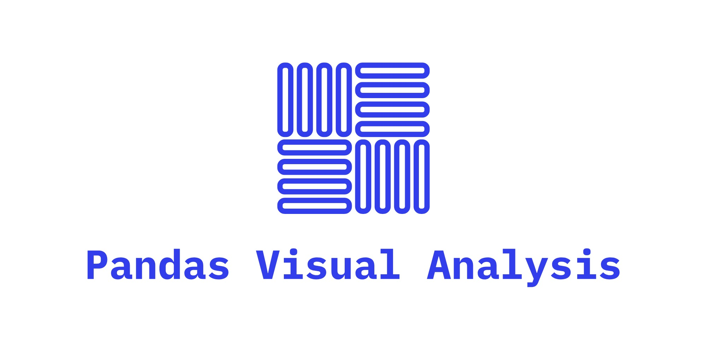

.. image:: https://github.com/meffmadd/pandas-visual-analysis/workflows/Tests/badge.svg
    :target: https://github.com/meffmadd/pandas-visual-analysis/actions?query=workflow%3ATests

.. image:: https://api.codacy.com/project/badge/Grade/87128508f93c474ba93f6eff45e5a9fb
    :alt: Codacy Badge
    :target: https://app.codacy.com/manual/meffmadd/pandas-visual-analysis?utm_source=github.com&utm_medium=referral&utm_content=meffmadd/pandas-visual-analysis&utm_campaign=Badge_Grade_Settings

.. image:: https://codecov.io/gh/meffmadd/pandas-visual-analysis/branch/master/graph/badge.svg
    :target: https://codecov.io/gh/meffmadd/pandas-visual-analysis

.. image:: https://img.shields.io/badge/code%20style-black-000000.svg
    :target: https://github.com/psf/black

.. image:: https://img.shields.io/badge/License-MIT-yellow.svg
    :alt: MIT License
    :target: https://opensource.org/licenses/MIT

==================
Installation
==================
.. installation-start

TODO

.. installation-end

==================
Usage
==================
.. usage-start

TODO

.. usage-end
